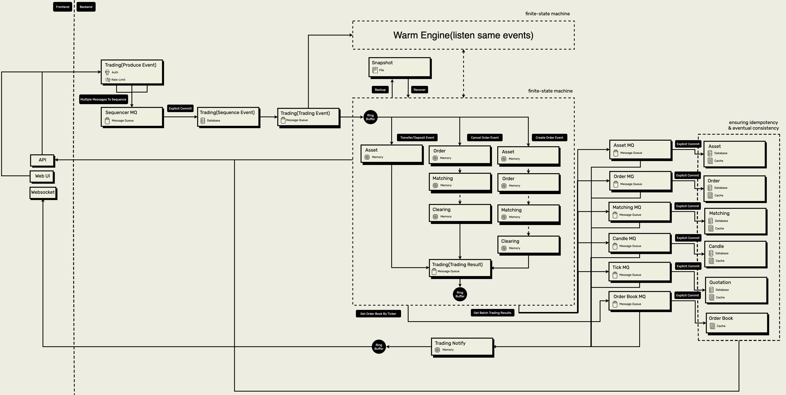
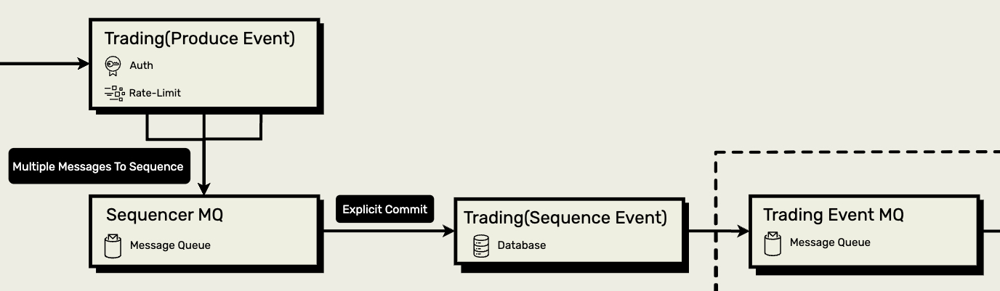
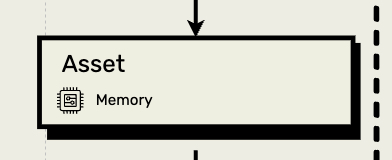
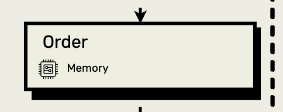
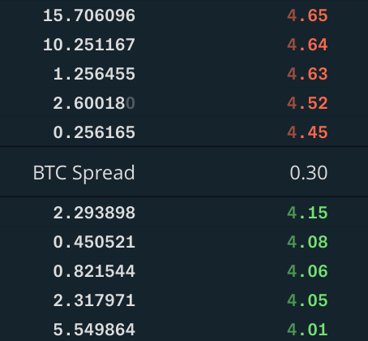

# system-design


依照[go-clean-arch-v3](https://github.com/bxcodec/go-clean-arch/tree/v3) clean architecture，每個domain依repository、usecase、delivery三層設計


* app: 實際啟動的server
* domain: domain interface與entity，不具邏輯，所有層都靠此domain interface傳輸entity進行溝通
* kit: 對mysql、mongodb、kafka、redis等底層進行封裝，抽象出介面後始得替換更容易
* instrumenting: prometheus、grafana、opentelemetry、logger等基礎建設
* 其餘資料夾: 依照repository、usecase、delivery實作的domain

```
.
├── app
│   ├── botclient
│   ├── chat
│   ├── exchange
│   ├── exchange-gitbitex
│   ├── simple
│   ├── urlshortener
│   └── user
├── domain
├── auth
│   ├── delivery
│   ├── repository
│   │   ├── account
│   │   └── auth
│   └── usecase
│       ├── account
│       └── auth
├── chat
│   ├── delivery
│   │   └── http
│   │       └── websocket
│   ├── repository
│   └── usecase
├── config
│   └── repository
├── exchange
│   ├── delivery
│   ├── repository
│   │   ├── asset
│   │   ├── candle
│   │   ├── matching
│   │   ├── order
│   │   ├── quotation
│   │   ├── sequencer
│   │   └── trading
│   └── usecase
│       ├── asset
│       ├── candle
│       ├── clearing
│       ├── currency
│       ├── matching
│       ├── order
│       ├── quotation
│       └── trading
├── line
│   └── repository
├── urshortener
│   ├── delivery
│   ├── repository
│   └── usecase
├── kit
│   ├── cache
│   ├── code
│   ├── core
│   │   ├── endpoint
│   │   └── transport
│   │       └── http
│   │           └── websocket
│   ├── http
│   │   ├── middleware
│   │   ├── transport
│   │   └── websocket
│   │       └── middleware
│   ├── logger
│   ├── mq
│   │   ├── kafka
│   │   └── memory
│   ├── orm
│   ├── ratelimit
│   │   ├── memory
│   │   └── redis
│   ├── testing
│   │   ├── kafka
│   │   │   └── container
│   │   ├── mongo
│   │   │   ├── container
│   │   │   └── memory
│   │   ├── mysql
│   │   │   └── container
│   │   ├── postgres
│   │   │   └── container
│   │   └── redis
│   │       └── container
│   ├── trace
│   └── util
└── instrumenting
```

* 不同層依照domain interface進行DIP
* 對底層進行抽象，可輕易LSP
  * repository方面: repository使用mq時，可採用`kit/mq/kafka`或`kit/mq/memory`，以應付不同場景或減低測試成本
  * usecase方面: usecase使用repository依照domain interface操作，如果要`memory`替換成`mysql`，只需實作出符合interface的repository
  * delivery方面: delivery使用usecase依照domain interface操作，如果要`gin`替換成`go-kit` server，不會修改到業務邏輯
* 切出每個domain的邊界，可先以monolithic部署，如果未來有horizontal scaling需求，再以domain來deliver給不同microservice，避免一開始就使用microservice過度設計
* 高reuse，application可以從組合不同domain，來完成產品需求，例如`app/exchange-gitbitex`是組合`auth`與`exchange`domain
* monorepo，所有applications的底層使用`kit`，更新方便，如果套件需要版本控制也可用`git tag`處理
* 以testcontainers測試，更貼近真實情境進行測試

## exchange-gitbitex


```
.
├── app
│   └── exchange-gitbitex
├── domain
├── auth
│   ├── delivery
│   ├── repository
│   └── usecase
│       ├── account
│       └── auth
├── exchange
│   ├── delivery
│   ├── repository
│   │   ├── sequencer
│   └── usecase
│       ├── asset
│       ├── candle
│       ├── clearing
│       ├── currency
│       ├── matching
│       ├── order
│       ├── quotation
│       └── trading
└── kit
```

撮合系統。將[exchange domain](https://github.com/superj80820/system-design/tree/master/exchange)與[gitbitex-web](https://github.com/gitbitex/gitbitex-web)串接

* 單一交易對，要實現多個交易對可以架設多個`app/exchange-gitbitex`
* 以event sourcing的方式實現，儲存event後，撮合引擎為讀取event的有限狀態機，可熱備援用多台server同時聽取event，來達到high availability
* 撮合引擎以記憶體計算，可達到100,000PRS
* 預覽網頁(❗僅用最低效能運行預覽，不是production運作規格): https://preview.exchange.messfar.com

### 壓測

使用k6進行


  * exchange機器: EC2 c5.18xlarge
  * k6機器: EC2 m5.8xlarge
  * RPS (max): 102,988.52
  * 情境: 單機啟動server、mysql、kafka、redis、mongodb，並進行買賣單搓合，如果將mysql或kafka等服務獨立出來，理論上可用更便宜的機器

### 系統架構



撮合系統主要由Sequence(定序模組)、Asset(資產模組)、Order(訂單模組)、Matching(撮合模組)、Clearing(清算模組)組成。

以訂單事件來舉例:

1. 大量併發的訂單請求進入服務
2. 定序模組會將訂單以有序的方式儲存
3. 資產模組凍結訂單所需資產
4. 訂單模組產生訂單
5. 撮合模組獲取訂單進行撮合，更新order book後產生match result
6. 清算模組依照match result來transfer、unfreeze資產
7. 各模組產生的result組成trading result，produce給下游服務，下游服務透過這些資料cache與persistent data來達到eventual consistency

由於需要快速計算撮合內容，計算都會直接在memory完成，過程中不會persistent data，但如果撮合系統崩潰，memory資料都會遺失，所以才需定序模組將訂單event都儲存好，再進入撮合系統，如此一來，如果系統崩潰也可以靠已儲存的event來recover撮合系統。

下游服務都須考慮idempotency冪等性，可透過sequence id來判斷event是否重複或超前，如果重複就拋棄，超前就必須讀取先前的event。

### Sequence 定序模組



如何快速儲存event是影響系統寫入速度的關鍵，kafka是可考慮的選項之一。

kafka為append-only logs，不需像RDBMS在需查找與更新索引會增加磁碟I/O操作，並且使用zero-copy快速寫入磁碟來persistent。

create order API只需將snowflake的`orderID`、`referenceID`(全局參考ID)等metadata帶入event，並傳送給kafka sequence topic，即完成了創建訂單的事項，可回傳`200 OK`給客戶端。

```go
func (t *tradingUseCase) ProduceCreateOrderTradingEvent(ctx context.Context, userID int, direction domain.DirectionEnum, price, quantity decimal.Decimal) (*domain.TradingEvent, error) {
	referenceID, err := utilKit.SafeInt64ToInt(utilKit.GetSnowflakeIDInt64())
	if err != nil {
		return nil, errors.Wrap(err, "safe int64 to int failed")
	}
	orderID, err := utilKit.SafeInt64ToInt(utilKit.GetSnowflakeIDInt64())
	if err != nil {
		return nil, errors.Wrap(err, "safe int64 to int failed")
	}

	tradingEvent := &domain.TradingEvent{
		ReferenceID: referenceID,
		EventType:   domain.TradingEventCreateOrderType,
		OrderRequestEvent: &domain.OrderRequestEvent{
			UserID:    userID,
			OrderID:   orderID,
			Direction: direction,
			Price:     price,
			Quantity:  quantity,
		},
	}

	if err := t.sequencerRepo.SendTradeSequenceMessages(ctx, tradingEvent); err != nil {
		return nil, errors.Wrap(err, "send trade sequence messages failed")
	}

	return tradingEvent, nil
}
```

#### Explicit Commit

kafka sequence topic的consume到event後，需為event定序，將一批已經定序events的透過`sequencerRepo.SaveEvents()`儲存，儲存過程中有可能會有失敗，如失敗就不對kafka進行commit，下次consume會消費到同批events重試，直到成功在commit。

如果是`sequencerRepo.SaveEvents()`儲存成功，但commit失敗，下次consume也會消費到同批events，這時需ignore掉已儲存的events，只儲存新的events，在用最新的event進行commit。

雖然沒辦法保證每次consume都成功處理，但我們可以確保consume失敗後會重試直到成功再commit。

```go
t.sequencerRepo.SubscribeGlobalTradeSequenceMessages(func(tradingEvents []*domain.TradingEvent, commitFn func() error) {
  sequencerEvents := make([]*domain.SequencerEvent, len(tradingEvents))
  tradingEventsClone := make([]*domain.TradingEvent, len(tradingEvents))
  for idx := range tradingEvents {
    sequencerEvent, tradingEvent, err := t.sequenceMessage(tradingEvents[idx])
    if err != nil {
      setErrAndDone(errors.Wrap(err, "sequence message failed"))
      return
    }
    sequencerEvents[idx] = sequencerEvent
    tradingEventsClone[idx] = tradingEvent
  }

  err := t.sequencerRepo.SaveEvents(sequencerEvents)
  if mysqlErr, ok := ormKit.ConvertMySQLErr(err); ok && errors.Is(mysqlErr, ormKit.ErrDuplicatedKey) {
    // if duplicate, filter events then retry
    // another code...
    return
  } else if err != nil {
    panic(errors.Wrap(err, "save event failed"))
  }

  if err := commitFn(); err != nil {
    setErrAndDone(errors.Wrap(err, "commit latest message failed"))
    return
  }

  t.tradingRepo.SendTradeEvent(ctx, tradingEventsClone)
})
```

### Asset 資產模組



用戶資產除了基本的UserID、AssetID、Available(可用資產)，還需Frozen(凍結資產)欄位，以實現用戶下單時把下單資金凍結。

```go
type UserAsset struct {
	UserID    int
	AssetID   int
	Available decimal.Decimal
	Frozen    decimal.Decimal
}
```

一個交易對會有多個用戶，並且每個用戶都會有多個資產，如果資產都需存在memory當中，可以用兩個hash table來實作asset repository。

由於在撮合時也有機會透過API讀取memory的用戶資產，所以須用read-write-lock保護。

```go
type assetRepo struct {
	usersAssetsMap map[int]map[int]*domain.UserAsset
	lock           *sync.RWMutex

	// another fields...
}
```

用戶資產的use case主要有轉帳`Transfer()`、凍結`Freeze()`、解凍`Unfreeze()`，另外我們還需liability user(負債帳戶)，他代表整個系統實際的資產，也可用來對帳，負債帳戶透過`LiabilityUserTransfer()`將資產從系統轉給用戶。

```go
type UserAssetUseCase interface {
	LiabilityUserTransfer(ctx context.Context, toUserID, assetID int, amount decimal.Decimal) (*TransferResult, error)

	TransferFrozenToAvailable(ctx context.Context, fromUserID, toUserID int, assetID int, amount decimal.Decimal) (*TransferResult, error)
	TransferAvailableToAvailable(ctx context.Context, fromUserID, toUserID int, assetID int, amount decimal.Decimal) (*TransferResult, error)
	Freeze(ctx context.Context, userID, assetID int, amount decimal.Decimal) (*TransferResult, error)
	Unfreeze(ctx context.Context, userID, assetID int, amount decimal.Decimal) (*TransferResult, error)

	// ..another functions
}
```

如果liability user id為1、用戶A user id為100、btc id為1、usdt id為2，其他用戶在系統已存入10btc與100000usdt。

此時用戶A對系統deposit儲值100000 usdt，並下了1顆btc價格為62000usdt的買單，此時需凍結62000usdt，將資產直接展開成一個二維表顯示如下:

|user id|asset id|available|frozen|
|---|---|---|---|
|1|1|-10|0|
|1|2|-200000|0|
|100|1|0|0|
|100|2|38000|62000|
|...其他用戶||||

在deposit時會呼叫`LiabilityUserTransfer()`，`assetRepo`呼叫`GetAssetWithInit()`，如果用戶資產存在則返回，不存在則初始化創建，資產模組在需要使用用戶資產時才創建他，不需先預載用戶資料表，也因為如此，在進入撮合系統前的auth非常重要，必須是認證過的用戶才能進入資產模組。

liability user呼叫`SubAssetAvailable()`減少資產，用戶呼叫`AddAssetAvailable()`獲取資產，資產的變動會呼叫`transferResult.addUserAsset()`添加至`transferResult`，最後回應給下游服務。

```go
func (u *userAsset) LiabilityUserTransfer(ctx context.Context, toUserID, assetID int, amount decimal.Decimal) (*domain.TransferResult, error) {
	if amount.LessThanOrEqual(decimal.Zero) {
		return nil, errors.New("can not operate less or equal zero amount")
	}

	transferResult := createTransferResult()

	liabilityUserAsset, err := u.assetRepo.GetAssetWithInit(domain.LiabilityUserID, assetID)
	if err != nil {
		return nil, errors.Wrap(err, "get asset with init failed")
	}
	toUserAsset, err := u.assetRepo.GetAssetWithInit(toUserID, assetID)
	if err != nil {
		return nil, errors.Wrap(err, "get asset with init failed")
	}

	u.assetRepo.SubAssetAvailable(liabilityUserAsset, amount)
	u.assetRepo.AddAssetAvailable(toUserAsset, amount)

	transferResult.addUserAsset(liabilityUserAsset)
	transferResult.addUserAsset(toUserAsset)

	return transferResult.TransferResult, nil
}
```

其他的use case都與`LiabilityUserTransfer()`類似，只是資產的轉移有差異，最後都會透過`transferResult`將變動的資產回應給下游服務。

在創建訂單時呼叫`Freeze()`，先檢查用戶是否有足夠資產`userAsset.Available.Cmp(amount) < 0`，如果足夠則呼叫`SubAssetAvailable()`減少資產，並呼叫`AddAssetFrozen()`增加凍結資產。

```go
func (u *userAsset) Freeze(ctx context.Context, userID, assetID int, amount decimal.Decimal) (*domain.TransferResult, error) {
	// another code...

	if userAsset.Available.Cmp(amount) < 0 {
		return nil, errors.Wrap(domain.LessAmountErr, "less amount err")
	}
	u.assetRepo.SubAssetAvailable(userAsset, amount)
	u.assetRepo.AddAssetFrozen(userAsset, amount)

	transferResult.addUserAsset(userAsset)

	return transferResult.TransferResult, nil
}
```

在撮合訂單時呼叫`TransferFrozenToAvailable()`，先檢查用戶(fromUser)是否有足夠的凍結資產後呼叫`SubAssetFrozen()`減少凍結用戶(fromUser)資產，並呼叫`AddAssetAvailable()`增加用戶(toUser)資產。

```go
func (u *userAsset) TransferFrozenToAvailable(ctx context.Context, fromUserID, toUserID, assetID int, amount decimal.Decimal) (*domain.TransferResult, error) {
	// another code...

	if fromUserAsset.Frozen.Cmp(amount) < 0 {
		return nil, errors.Wrap(domain.LessAmountErr, "less amount err")
	}
	u.assetRepo.SubAssetFrozen(fromUserAsset, amount)
	u.assetRepo.AddAssetAvailable(toUserAsset, amount)

	transferResult.addUserAsset(fromUserAsset)
	transferResult.addUserAsset(toUserAsset)

	return transferResult.TransferResult, nil
}
```

在用戶轉帳時呼叫`TransferAvailableToAvailable()`，檢查用戶(fromUser)是否有足夠資產後呼叫`SubAssetAvailable()`減少資產並呼叫`AddAssetAvailable()`增加用戶(toUser)資產。

```go
func (u *userAsset) TransferAvailableToAvailable(ctx context.Context, fromUserID, toUserID, assetID int, amount decimal.Decimal) (*domain.TransferResult, error) {
	// another code...

	if fromUserAsset.Available.Cmp(amount) < 0 {
		return nil, errors.Wrap(domain.LessAmountErr, "less amount err")
	}
	u.assetRepo.SubAssetAvailable(fromUserAsset, amount)
	u.assetRepo.AddAssetAvailable(toUserAsset, amount)

	transferResult.addUserAsset(fromUserAsset)
	transferResult.addUserAsset(toUserAsset)

	return transferResult.TransferResult, nil
}
```

### Order 訂單模組



活動訂單需由訂單模組管理，可以用hash table以`orderID: order`儲存所有活動訂單，在需要以用戶ID取得相關活動訂單時，可用兩層hash table以`userID: orderID: order`取得訂單。

由於在撮合時也有機會透過API讀取memory的活動訂單，所以須用read-write-lock保護。

```go
type orderUseCase struct {
	lock          *sync.RWMutex
	activeOrders  map[int]*domain.OrderEntity
	userOrdersMap map[int]map[int]*domain.OrderEntity

  // ...another fields
}
```

活動訂單的欄位介紹如下:

```go
type OrderEntity struct {
	ID         int // 訂單ID
	SequenceID int // 訂單由定序模組所定的ID
	UserID     int // 用戶ID

	Price     decimal.Decimal // 價格
	Direction DirectionEnum   // 買單還是賣單

	// 狀態，分別是:
	// 完全成交(Fully Filled)、
	// 部分成交(Partial Filled)、
	// 等待成交(Pending)、
	// 完全取消(Fully Canceled)、
	// 部分取消(Partial Canceled)
	Status    OrderStatusEnum 

	Quantity         decimal.Decimal // 數量
	UnfilledQuantity decimal.Decimal // 未成交數量

	CreatedAt time.Time // 創建時間
	UpdatedAt time.Time // 更新時間
}
```

訂單模組主要的use case有創建訂單`CreateOrder()`、刪除訂單`RemoveOrder()`、取得訂單`GetUserOrders()`，由於在創建時需要凍結資產、刪除時需要解凍資產，所以須引入資產模組`UserAssetUseCase`。

```go
type OrderUseCase interface {
	CreateOrder(ctx context.Context, sequenceID int, orderID, userID int, direction DirectionEnum, price, quantity decimal.Decimal, ts time.Time) (*OrderEntity, *TransferResult, error)
	RemoveOrder(ctx context.Context, orderID int) error
	GetUserOrders(userID int) (map[int]*OrderEntity, error)

  // another functions...
}
```

資產模組在此處的命名為`o.assetUseCase`。

在創建訂單時呼叫`CreateOrder()`，需先判斷買賣單凍結用戶資產`o.assetUseCase.Freeze()`，之後創建`order`存入`o.activeOrders`與`o.userOrdersMap`，由於過程中有資產的變化，所以除了`order`以外，也需將`transferResult`回應給下游服務。

```go
func (o *orderUseCase) CreateOrder(ctx context.Context, sequenceID int, orderID int, userID int, direction domain.DirectionEnum, price decimal.Decimal, quantity decimal.Decimal, ts time.Time) (*domain.OrderEntity, *domain.TransferResult, error) {
	var err error
	transferResult := new(domain.TransferResult)

	switch direction {
	case domain.DirectionSell:
		transferResult, err = o.assetUseCase.Freeze(ctx, userID, o.baseCurrencyID, quantity)
		if err != nil {
			return nil, nil, errors.Wrap(err, "freeze base currency failed")
		}
	case domain.DirectionBuy:
		transferResult, err = o.assetUseCase.Freeze(ctx, userID, o.quoteCurrencyID, price.Mul(quantity))
		if err != nil {
			return nil, nil, errors.Wrap(err, "freeze base currency failed")
		}
	default:
		return nil, nil, errors.New("unknown direction")
	}

	order := domain.OrderEntity{
		ID:               orderID,
		SequenceID:       sequenceID,
		UserID:           userID,
		Direction:        direction,
		Price:            price,
		Quantity:         quantity,
		UnfilledQuantity: quantity,
		Status:           domain.OrderStatusPending,
		CreatedAt:        ts,
		UpdatedAt:        ts,
	}

	o.lock.Lock()
	o.activeOrders[orderID] = &order
	if _, ok := o.userOrdersMap[userID]; !ok {
		o.userOrdersMap[userID] = make(map[int]*domain.OrderEntity)
	}
	o.userOrdersMap[userID][orderID] = &order
	o.lock.Unlock()

	return &order, transferResult, nil
}
```

在撮合訂單完全成交、取消訂單時會呼叫`RemoveOrder()`，`o.activeOrders`刪除訂單，而`o.userOrdersMap`透過訂單的userID查找也刪除訂單。

```go
func (o *orderUseCase) RemoveOrder(ctx context.Context, orderID int) error {
	o.lock.Lock()
	defer o.lock.Unlock()

	removedOrder, ok := o.activeOrders[orderID]
	if !ok {
		return errors.New("order not found in active orders")
	}
	delete(o.activeOrders, orderID)

	userOrders, ok := o.userOrdersMap[removedOrder.UserID]
	if !ok {
		return errors.New("user orders not found")
	}
	_, ok = userOrders[orderID]
	if !ok {
		return errors.New("order not found in user orders")
	}
	delete(userOrders, orderID)

	return nil
}
```

API取得訂單會呼叫`GetUserOrders()`，為了避免race-condition，查找到訂單後需將訂單clone再回傳。

```go
func (o *orderUseCase) GetUserOrders(userId int) (map[int]*domain.OrderEntity, error) {
	o.lock.RLock()
	defer o.lock.RUnlock()

	userOrders, ok := o.userOrdersMap[userId]
	if !ok {
		return nil, errors.New("get user orders failed")
	}
	userOrdersClone := make(map[int]*domain.OrderEntity, len(userOrders))
	for orderID, order := range userOrders {
		userOrdersClone[orderID] = order.Clone()
	}
	return userOrdersClone, nil
}
```

### Matching 撮合模組


* 撮合模組是整個搓合系統最核心的部分
* 事實上就是維護一個買單order-book一個賣單order-book
* order-book必須用一個快速的方式實現查詢、插入、刪除、排序
  * 如果是用list會比較慢，因為
    * 查詢: O(n)
    * 插入: O(n)
    * 刪除: O(n)
    * 排序: O(nlogn)
  * 如果是用link-list也不夠快，因為
    * 查詢: O(n)
    * 插入: O(n)
    * 刪除: O(n)
    * 排序: O(nlogn)
  * 如果是用double-link-list也不夠快，因為
    * 查詢: O(n)
    * 插入: O(1)
    * 刪除: O(1)
    * 排序: O(nlogn)
  * 紅黑數的話比較適合，因為
  * 如果是用double-link-list也不夠快，因為
    * 查詢: O(logn)
    * 插入: O(logn)
    * 刪除: O(logn)
    * 排序: O(nlogn)




### Clearing 清算模組

### 運行

* require:
  * golang v1.20
  * docker

* development:
  ```
  $ cd app/exchange-gitbitex
  $ make dev
  ```

### 參考

* [廖雪峰-设计交易引擎](https://www.liaoxuefeng.com/wiki/1252599548343744/1491662232616993)
* [gitbitex](https://github.com/gitbitex)

## urlshortener

短網址服務

## chat

聊天服務